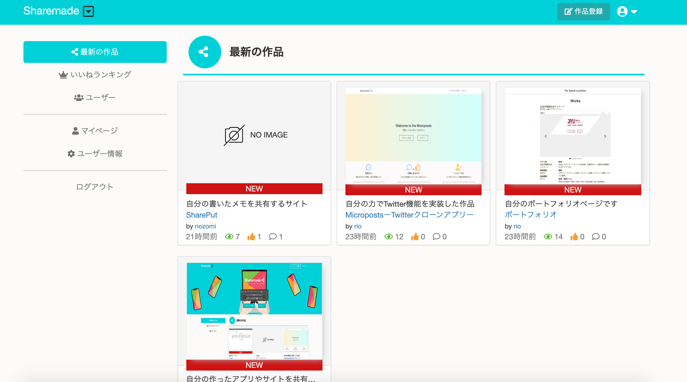
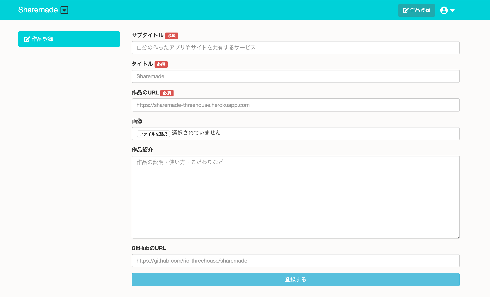
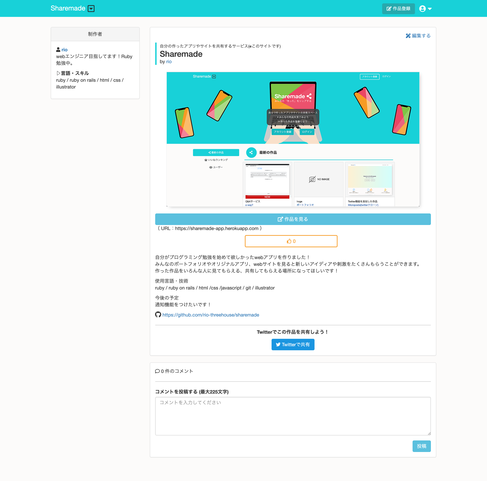

# Sharemadeについて

## Sharemadeってどんなwebアプリ？  

オリジナルのアプリやサイト、ポートフォリオを共有できるwebアプリです。  
自分の作ったアプリ、サイトをsharemadeに登録すれば、自分の作品を簡単に紹介することができます。    
  
◆herokuでアプリを公開しています[https://sharemade-app.herokuapp.com](https://sharemade-app.herokuapp.com/)

## 使用言語・技術  
Ruby:2.6.2 / Ruby on Rails:5.0.6 / javascript / html / css / git / illustrator  

##  アプリを作った目的
以下２つの思いからこのアプリを作りました。  
  
・プログラミング学習中、いろんな人のポートフォリオを見て刺激を受けた。→もっと気軽にみんなの作ったサイトやアプリを見たい！  
・自分のアプリを色々な人に知ってもらえる、使ってもらえる環境がほしい！　

## 実装機能
・ログイン機能  
・いいね機能  
・コメント機能  
・非同期でいいね、コメント  
・画像アップロード機能（s３使用）  
・tweetボタンを押してtwitterで作品共有  
・いいねのランキング機能  
・管理者権限機能　　

## アピールポイント
・非同期でいいね、コメントができる  
・twitterに作品詳細ページのurlを貼ると、twitterカードがそれぞれの作品の内容になる  
・s3と連携した画像アップロード機能  
・deviseによるユーザー認証のカスタマイズ  

## 
作品登録ページ
 
  
作品詳細ページ

